# /depin-diagram — Generate Architecture Diagrams

Generates Mermaid diagrams for DePIN network architecture, data flow, and component relationships for all seven DePIN patterns.

## Usage

```
/depin-diagram [pattern] [diagram-type]
```

**Patterns:** `connectivity` · `sensor` · `compute` · `mapping` · `bandwidth` · `storage` · `energy`
**Types:** `architecture` · `dataflow` · `components` · `security`

---

## Pattern A — Connectivity (Helium-style)

### Architecture

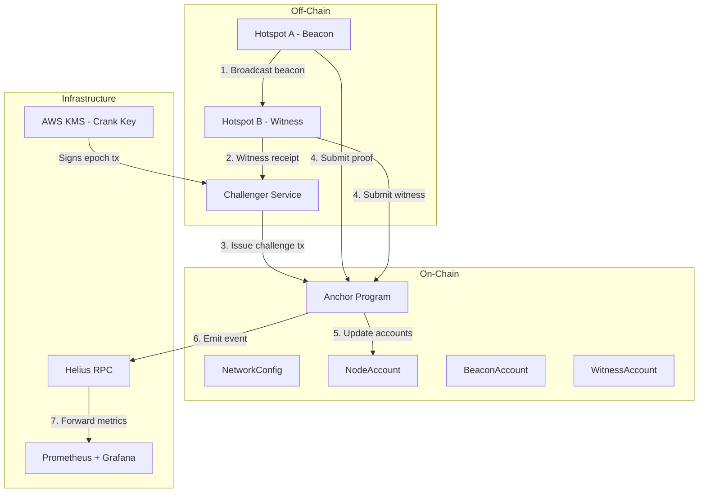

### Data Flow

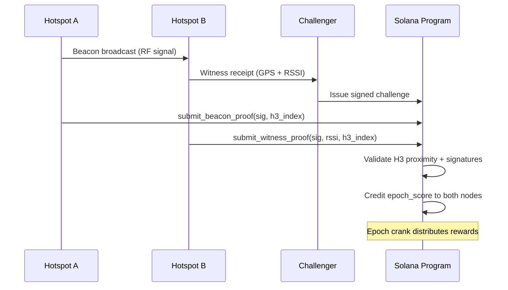

---

## Pattern C — Compute (io.net-style)

### Architecture

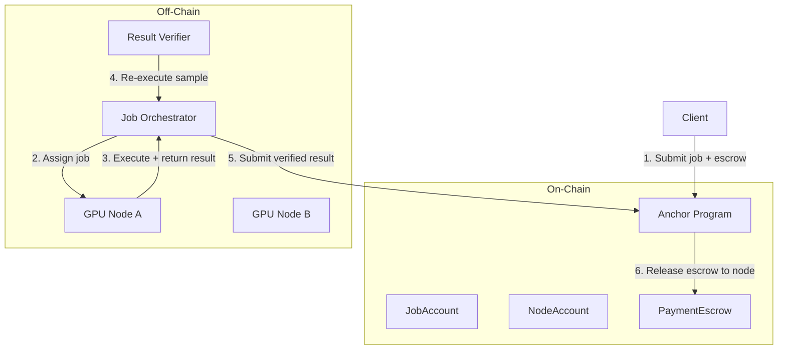

---

## Pattern F — Lidar/Drive Mapping (Hivemapper-style)

### Architecture

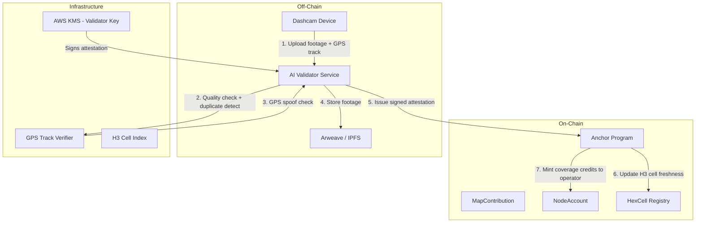

### Data Flow — Drive Submission

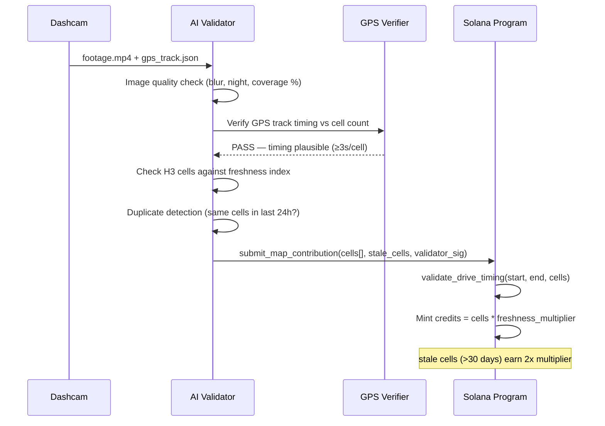

### Anti-Gaming — GPS Spoof Detection

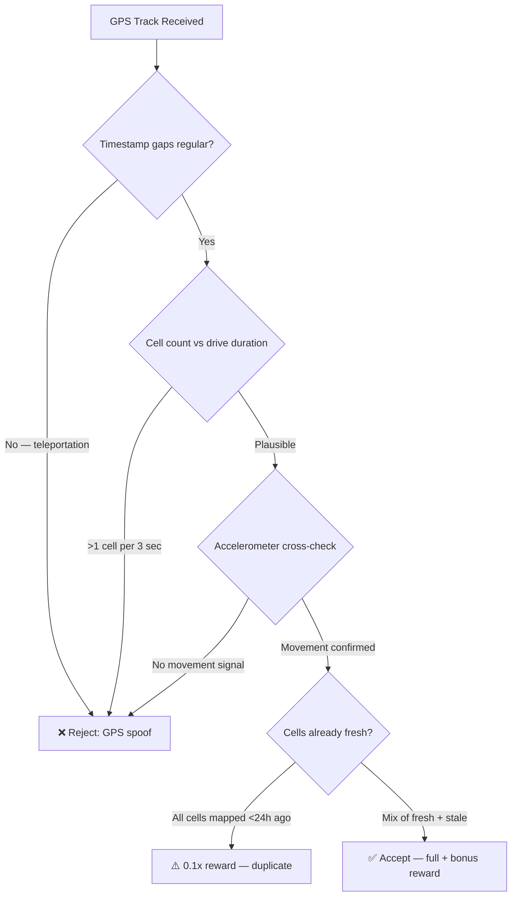

---

## Pattern G — Energy (Powerledger-style)

### Architecture

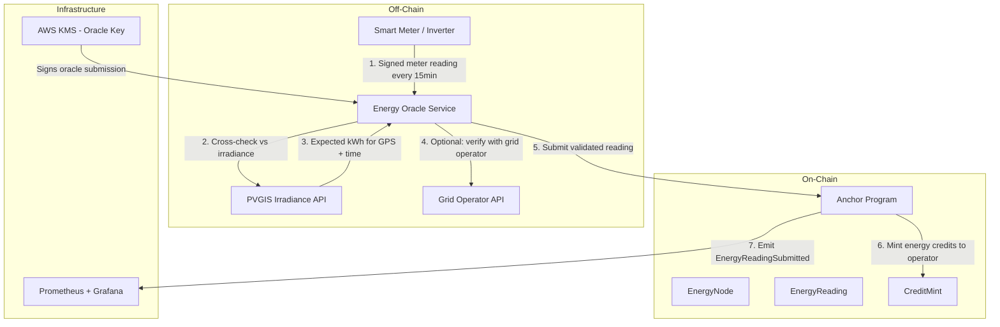

### Data Flow — Meter Reading to Credit

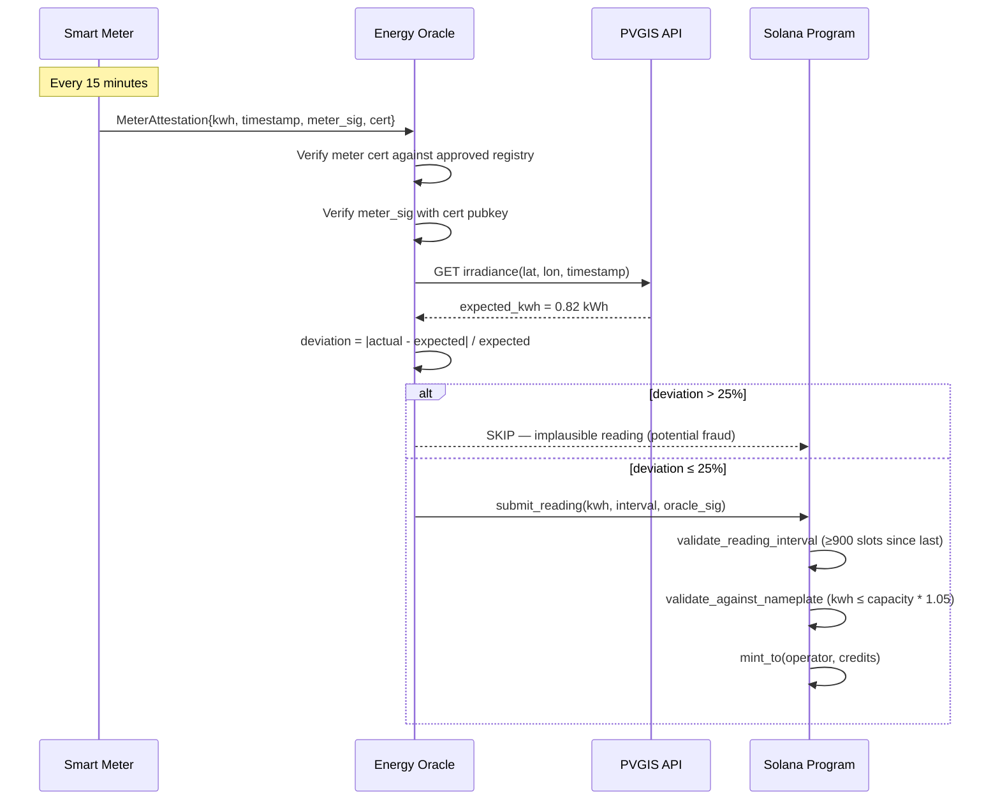

### Demand Response Flow

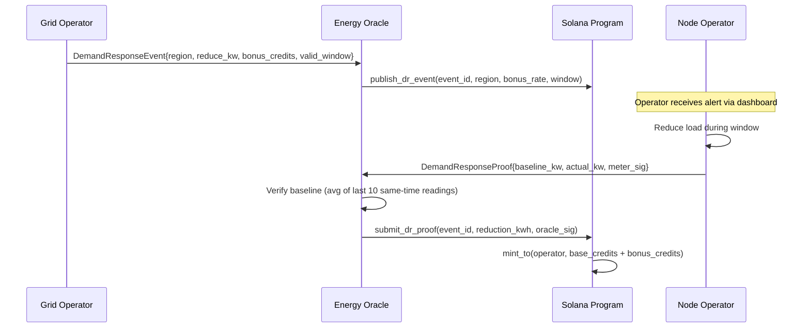

---

## Pattern F — Storage (Arweave/Filecoin-style)

### Architecture

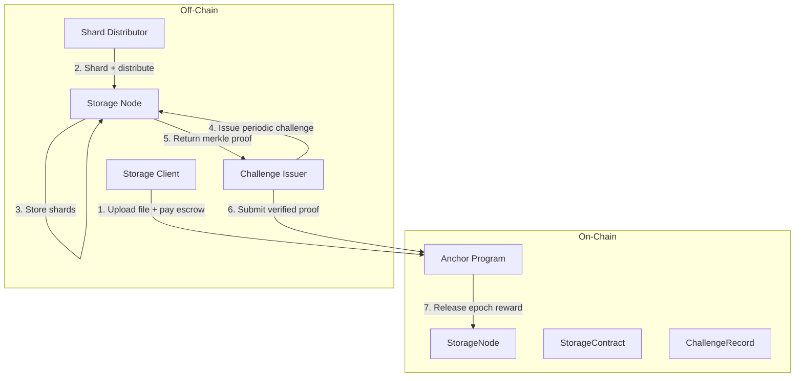

### Challenge-Response Data Flow

```mermaid
sequenceDiagram
    participant CH as Challenge Issuer
    participant SN as Storage Node
    participant SOL as Solana Program
    Note over CH: Every epoch (e.g., 1hr)
    CH->>SOL: get_random_challenge_seed(epoch, node)
    SOL-->>CH: seed = hash(epoch || node_pubkey || recent_blockhash)
    CH->>SN: Challenge{seed, byte_range_start, byte_range_len}
    SN->>SN: Compute merkle proof for requested byte range
    SN->>CH: MerkleProof{root, path, leaf_data}
    CH->>CH: Verify proof against stored merkle root
    alt Proof invalid or timeout
        CH->>SOL: report_challenge_failure(node, epoch)
        SOL->>SOL: Increment slash_count; jail if threshold reached
    else Proof valid
        CH->>SOL: submit_storage_proof(node, epoch, proof_hash)
        SOL->>SOL: Credit epoch reward to node
    end
```

---

## Security Diagram (all patterns)

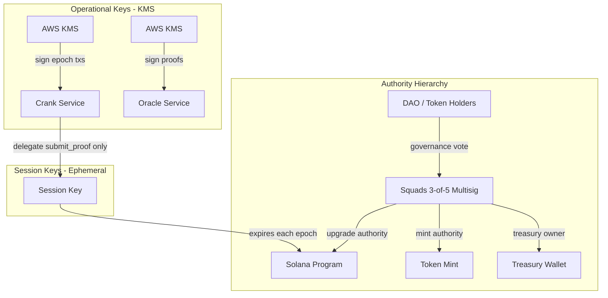

---

## Export Options

```bash
# Install Mermaid CLI
npm install -g @mermaid-js/mermaid-cli

# Export any diagram to PNG
mmdc -i diagram.mmd -o diagram.png -b transparent

# Export to SVG (preferred for docs)
mmdc -i diagram.mmd -o diagram.svg

# Batch export all diagrams in a folder
for f in diagrams/*.mmd; do mmdc -i "$f" -o "${f%.mmd}.svg"; done
```

## Follow-up Commands

- `/depin-design` — full network design using these patterns
- `/depin-deploy` — deployment checklist after architecture is finalised
- Load `skill/network-architecture.md` for deep pattern guidance
