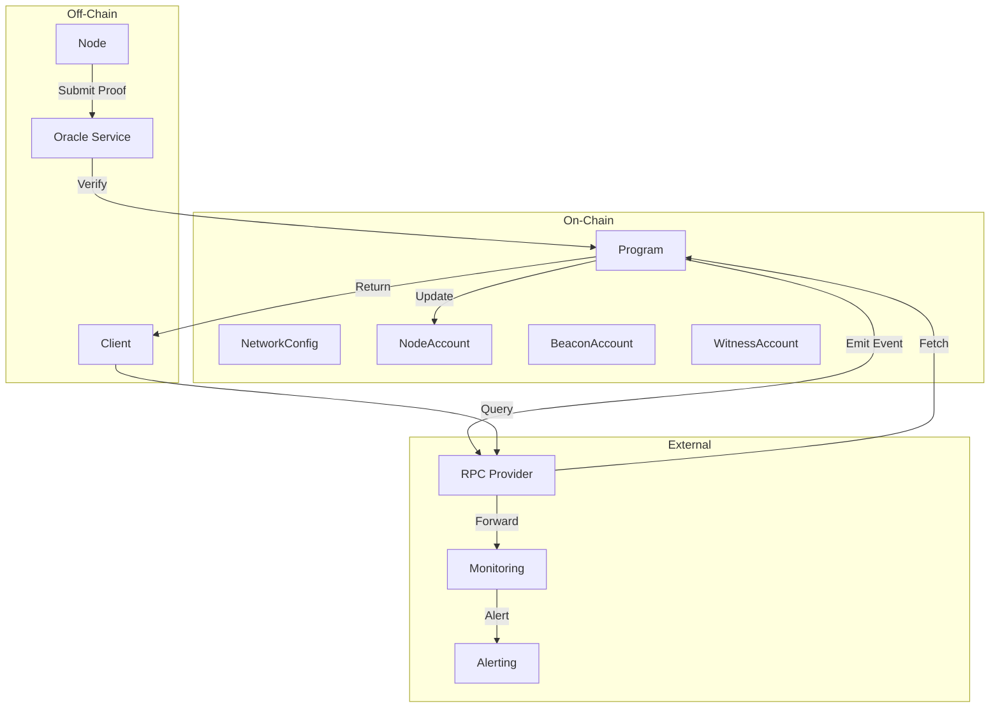
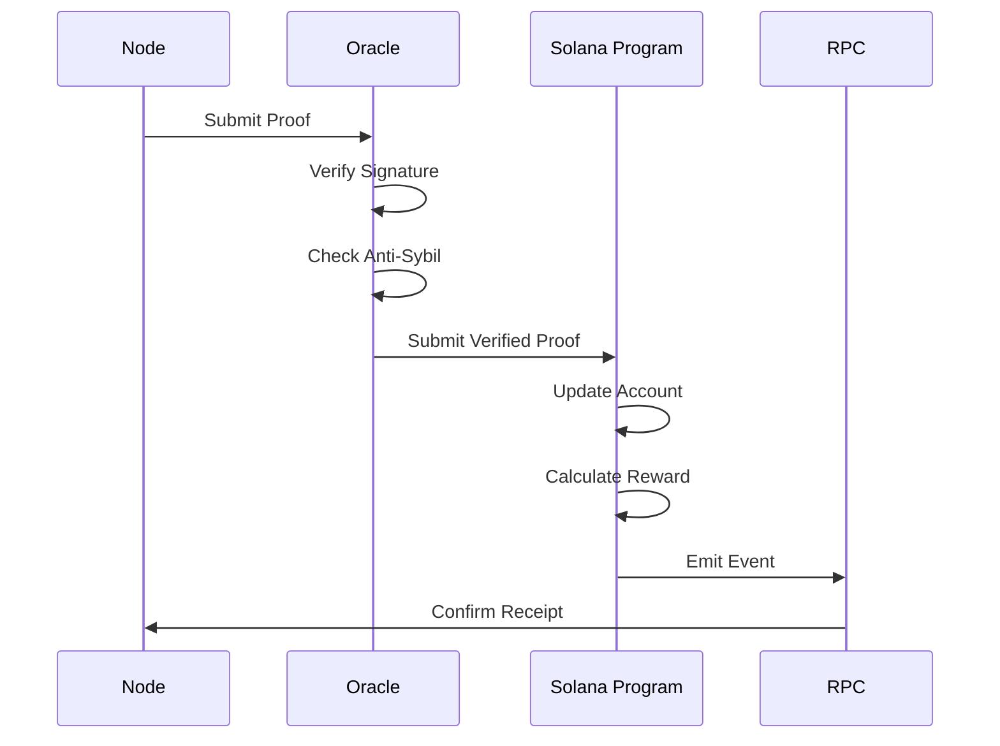
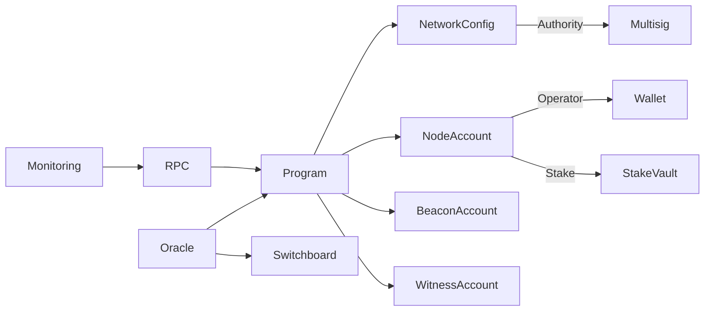

# /depin-diagram — Generate Architecture Diagrams

Generates Mermaid diagrams for DePIN network architecture, data flow, and component relationships.

## Usage

```
/depin-diagram [diagram-type]
```

## Diagram Types

### 1. Architecture Overview
```
/depin-diagram architecture
```

Generates a high-level architecture diagram showing:
- On-chain components (Solana program, accounts)
- Off-chain components (Oracle, nodes, clients)
- Data flow between components
- External integrations

### 2. Data Flow
```
/depin-diagram dataflow
```

Generates a detailed data flow diagram showing:
- Proof submission flow
- Reward distribution flow
- Node registration flow
- Oracle verification flow

### 3. Component Relationships
```
/depin-diagram components
```

Generates a component relationship diagram showing:
- Account dependencies
- Instruction call hierarchy
- External service dependencies
- Module interactions

## Output Format

Diagrams are generated as Mermaid code blocks that can be:
- Rendered in Mermaid-compatible markdown viewers
- Exported to PNG/SVG using Mermaid CLI
- Embedded in documentation

## Example Output

### Architecture Overview Diagram



### Data Flow Diagram



### Component Relationships Diagram



## Integration with Documentation

Generated diagrams can be embedded in:
- README.md for project overview
- SKILL.md for architecture documentation
- AGENTS.md for agent workflows
- Technical documentation

## Export Options

### Export to PNG
```bash
mmdc -i architecture.mmd -o architecture.png
```

### Export to SVG
```bash
mmdc -i architecture.mmd -o architecture.svg
```

### Export to PDF
```bash
mmdc -i architecture.mmd -o architecture.pdf
```

## Customization

You can customize diagrams by:
- Adding custom labels
- Changing layout direction (TB, LR, TD)
- Adding styling (colors, shapes)
- Including subgraphs for grouping

## Follow-up Commands

After generating diagrams:
- `/depin-design` — Full network design
- `/depin-audit` — Audit existing architecture
- `/depin-deploy` — Deployment checklist
