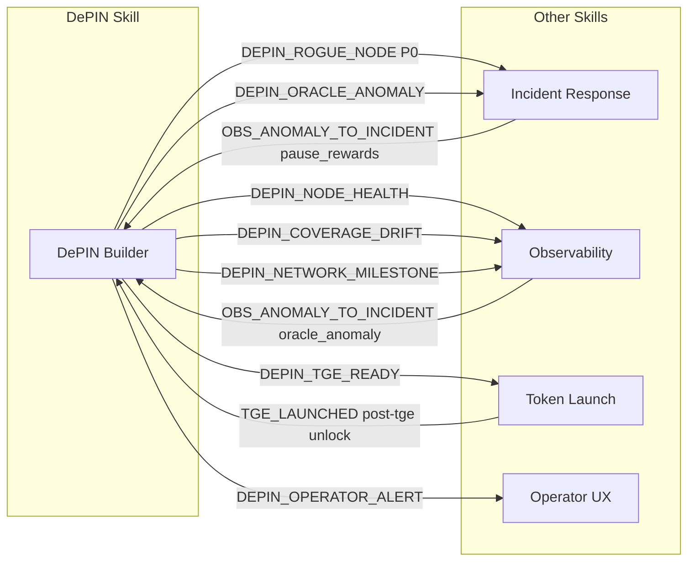

# Ecosystem Signals — DePIN Builder Skill

> **Canonical location:** `ecosystem-signals.md` (repo root)
>
> This is the single authoritative source for all cross-skill communication
> protocols in the DePIN Builder skill. It covers both the DePIN-specific
> typed signal schemas and the generic cross-skill event framework.
>
> Load this file when you need to emit or handle any signal that crosses
> skill boundaries.

---

## Signal Taxonomy

```
OUTBOUND (DePIN → other skills)
  ├── DePIN → Observability     : node health metrics, network milestones, performance degradation
  ├── DePIN → Incident Response : rogue nodes, oracle anomalies, security events, coverage drift
  ├── DePIN → Token Launch      : TGE readiness gate
  └── DePIN → UX / Operator     : operator alerts, slash notifications, session key expiry

INBOUND (other skills → DePIN)
  ├── Incident Response → DePIN : confirmed exploit → pause reward distribution
  ├── Observability → DePIN     : anomaly detected → trigger rogue-node runbook
  └── Token Launch → DePIN      : post-TGE unlock schedule → adjust emission parameters
```

---

## Part 1 — Typed Signal Schemas (Production)

These are the strongly-typed signal interfaces used in production code.
Use these when implementing the emit function or writing signal handlers.

### DEPIN_NODE_HEALTH → Observability

Emitted every epoch by the reward crank when distributing rewards.

```typescript
// src/signals/node-health-signal.ts
export interface DepinNodeHealthSignal {
  signal: "DEPIN_NODE_HEALTH";
  source_skill: "solana-depin-builder-skill";
  network_id: string;
  epoch: number;
  node_address: string;
  operator_address: string;
  status: "active" | "warning" | "offline" | "jailed";
  uptime_pct_7d: number;
  proof_submissions_epoch: number;
  reward_earned_epoch: number;   // token base units
  slash_count_30d: number;
  h3_index?: string;
  timestamp_utc: string;
}
// Prometheus metrics: solana_depin_node_active, solana_depin_node_stake_lamports
```

### DEPIN_ORACLE_ANOMALY → Incident Response + Observability (alert)

```typescript
export interface DepinOracleAnomalySignal {
  signal: "DEPIN_ORACLE_ANOMALY";
  source_skill: "solana-depin-builder-skill";
  severity: "P0" | "P1" | "P2";
  network_id: string;
  oracle_feed: string;
  anomaly_type:
    | "DEVIATION_EXCEEDED"
    | "SUBMISSION_STALE"
    | "SYBIL_CLUSTER_DETECTED"
    | "REPLAY_ATTACK"
    | "SIGNATURE_INVALID";
  affected_nodes: string[];
  current_value?: number;
  expected_range?: [number, number];
  evidence_signature?: string;
  recommended_action: string;
  timestamp_utc: string;
}
```

### DEPIN_COVERAGE_DRIFT → Observability + Incident Response

```typescript
export interface DepinCoverageDriftSignal {
  signal: "DEPIN_COVERAGE_DRIFT";
  source_skill: "solana-depin-builder-skill";
  severity: "P1" | "P2";
  network_id: string;
  drift_type:
    | "HEXAGON_VACANCY"
    | "UPTIME_SLO_BREACH"
    | "GEOGRAPHIC_CONCENTRATION"
    | "OPERATOR_CHURN_SPIKE";
  affected_hexagons?: string[];
  churn_rate_pct?: number;
  current_coverage_pct?: number;
  slo_target_pct?: number;
  timestamp_utc: string;
}
```

### DEPIN_TGE_READY → Token Launch Skill

```typescript
export interface DepinTgeReadySignal {
  signal: "DEPIN_TGE_READY";
  source_skill: "solana-depin-builder-skill";
  network_id: string;
  readiness_score: number;       // 0–100
  gates: {
    min_nodes_met: boolean;
    geographic_distribution_met: boolean;
    oracle_stability_met: boolean;
    demand_side_revenue_met: boolean;
    security_audit_complete: boolean;
    emission_schedule_locked: boolean;
  };
  blocking_items: string[];
  recommended_launch_window: string;
  handoff_to: "solana-token-launch-skill";
  timestamp_utc: string;
}
```

### DEPIN_ROGUE_NODE → Incident Response (highest DePIN priority)

```typescript
export interface DepinRogueNodeSignal {
  signal: "DEPIN_ROGUE_NODE";
  source_skill: "solana-depin-builder-skill";
  severity: "P0" | "P1";
  network_id: string;
  rogue_type:
    | "SYBIL_CLUSTER"
    | "REWARD_DRAIN"
    | "FAKE_COVERAGE"
    | "ORACLE_POISONING"
    | "COORDINATED_ATTACK";
  suspected_nodes: string[];
  operator_address?: string;
  evidence: {
    tx_signatures: string[];
    h3_indices?: string[];
    proof_hashes?: string[];
  };
  recommended_action:
    | "SLASH_AND_JAIL"
    | "PAUSE_REWARDS_FOR_OPERATOR"
    | "EMERGENCY_PAUSE_PROGRAM"
    | "ALERT_AND_MONITOR";
  timestamp_utc: string;
}
```

### DEPIN_NETWORK_MILESTONE → Observability

```typescript
export interface DepinNetworkMilestoneSignal {
  signal: "DEPIN_NETWORK_MILESTONE";
  source_skill: "solana-depin-builder-skill";
  network_id: string;
  milestone_type: "nodes" | "stake" | "epochs" | "coverage" | "revenue";
  milestone_value: number;
  previous_milestone: number;
  achievement_date: string;
  next_target: number;
  timestamp_utc: string;
}
```

### DEPIN_OPERATOR_ALERT → Operator UX / Dashboard

```typescript
export interface DepinOperatorAlertSignal {
  signal: "DEPIN_OPERATOR_ALERT";
  source_skill: "solana-depin-builder-skill";
  operator_address: string;
  node_ids: string[];
  alert_type: "earnings_drop" | "node_offline" | "stake_risk" | "firmware_update" | "session_key_expiring";
  severity: "critical" | "warning" | "info";
  message: string;
  suggested_action: string;
  action_deadline?: string;
  timestamp_utc: string;
}
```

---

## Part 2 — Signal Routing Rules

| Signal | Primary Target | Secondary Target | Response SLA |
|--------|---------------|-----------------|--------------|
| `DEPIN_NODE_HEALTH` | Observability (metrics) | UX dashboard | Async / per epoch |
| `DEPIN_ORACLE_ANOMALY` | Incident Response | Observability (alert) | P0: immediate / P1: 15 min |
| `DEPIN_COVERAGE_DRIFT` | Observability | Growth team (internal) | 1 hour |
| `DEPIN_TGE_READY` | Token Launch | Founders (Discord) | Next planning cycle |
| `DEPIN_ROGUE_NODE` | Incident Response | Multisig authority | P0: immediate |
| `DEPIN_NETWORK_MILESTONE` | Observability | Marketing (Discord) | Async |
| `DEPIN_OPERATOR_ALERT` | Operator dashboard | Push notification | 5 min |

---

## Part 3 — Inbound Signal Handlers

### From Incident Response → DePIN (pause rewards)

```typescript
// When incident-response-skill confirms an active exploit:
export interface IncidentPauseInbound {
  signal: "OBS_ANOMALY_TO_INCIDENT";
  action_required: "PAUSE_DEPIN_REWARDS";
  program_id: string;
  incident_id: string;
}
// → call pause() on Anchor reward-distribution program
// → Load skill/incident-response-integration.md for full procedure
```

### From Observability → DePIN (anomaly trigger)

```typescript
export interface ObsAnomalyInbound {
  signal: "OBS_ANOMALY_TO_INCIDENT";
  source_skill: "Solana-observabilty-skill";
  alert_type: "DEPIN_ORACLE_ANOMALY" | "DEPIN_NODE_OFFLINE";
  // → Load skill/incident-response-integration.md → rogue-node runbook
}
```

### From Token Launch → DePIN (post-TGE)

```typescript
export interface TokenLaunchCompleteInbound {
  signal: "TGE_LAUNCHED";
  source_skill: "solana-token-launch-skill";
  token_mint: string;
  launch_price_usd: number;
  vesting_unlock_schedule: Array<{
    date_utc: string;
    amount: bigint;
    allocation_type: "team" | "investors" | "ecosystem" | "treasury";
  }>;
  // → adjust emission parameters for post-TGE reward schedule
  // → Load skill/depin-token-launch.md for unlock coordination
}
```

---

## Part 4 — Emit Function (Production)

```typescript
// src/signals/emit.ts
export type DepinSignal =
  | DepinNodeHealthSignal
  | DepinOracleAnomalySignal
  | DepinCoverageDriftSignal
  | DepinTgeReadySignal
  | DepinRogueNodeSignal
  | DepinNetworkMilestoneSignal
  | DepinOperatorAlertSignal;

export async function emitDepinSignal(
  signal: DepinSignal,
  config: {
    observabilityWebhook?: string;
    incidentWebhook?: string;
    tokenLaunchWebhook?: string;
    operatorWebhook?: string;
    discordOpsChannel?: string;
  }
): Promise<void> {
  const payload = JSON.stringify(signal);

  // P0/P1 → Incident Response + Discord ops ping
  if (
    signal.signal === "DEPIN_ROGUE_NODE" ||
    signal.signal === "DEPIN_ORACLE_ANOMALY"
  ) {
    if (config.incidentWebhook) {
      await fetch(config.incidentWebhook, {
        method: "POST",
        headers: { "Content-Type": "application/json" },
        body: payload,
      }).catch((err) => console.error("[signals] Incident webhook failed:", err));
    }
    const sev = (signal as any).severity;
    if (config.discordOpsChannel && (sev === "P0" || sev === "P1")) {
      await fetch(config.discordOpsChannel, {
        method: "POST",
        headers: { "Content-Type": "application/json" },
        body: JSON.stringify({
          content: `🚨 **${signal.signal}** — Severity: **${sev}**\n\`${(signal as any).network_id}\`\n${payload.slice(0, 1000)}`,
        }),
      }).catch(() => {});
    }
  }

  // Observability → metrics pipeline
  if (
    signal.signal === "DEPIN_NODE_HEALTH" ||
    signal.signal === "DEPIN_COVERAGE_DRIFT" ||
    signal.signal === "DEPIN_NETWORK_MILESTONE"
  ) {
    if (config.observabilityWebhook) {
      await fetch(config.observabilityWebhook, {
        method: "POST",
        headers: { "Content-Type": "application/json" },
        body: payload,
      }).catch((err) => console.error("[signals] Observability webhook failed:", err));
    }
  }

  // TGE readiness → Token Launch handoff
  if (signal.signal === "DEPIN_TGE_READY") {
    if (config.tokenLaunchWebhook) {
      await fetch(config.tokenLaunchWebhook, {
        method: "POST",
        headers: { "Content-Type": "application/json" },
        body: payload,
      }).catch((err) => console.error("[signals] Token Launch webhook failed:", err));
    }
    if (config.discordOpsChannel) {
      await fetch(config.discordOpsChannel, {
        method: "POST",
        headers: { "Content-Type": "application/json" },
        body: JSON.stringify({
          content: `🚀 **TGE READINESS GATE** — Score: **${(signal as DepinTgeReadySignal).readiness_score}/100**\nLoad \`solana-token-launch-skill\` to proceed.\n${payload.slice(0, 800)}`,
        }),
      }).catch(() => {});
    }
  }

  // Operator alerts → push notification / dashboard
  if (signal.signal === "DEPIN_OPERATOR_ALERT") {
    if (config.operatorWebhook) {
      await fetch(config.operatorWebhook, {
        method: "POST",
        headers: { "Content-Type": "application/json" },
        body: payload,
      }).catch((err) => console.error("[signals] Operator webhook failed:", err));
    }
  }
}
```

---

## Part 5 — Signal Flow Diagram



---

## Part 6 — Wallet-Specific Signals

These signals extend the base protocol for the wallet engineering framework.
All five skills must handle these. See `wallet-framework.md` for full routing.

### WALLET_KEY_COMPROMISED (P0)

```typescript
export interface WalletKeyCompromisedSignal {
  signal: "WALLET_KEY_COMPROMISED";
  severity: "P0";
  key_type: "user_wallet" | "fee_payer" | "upgrade_authority" | "mint_authority" | "treasury";
  compromised_address: string;
  confirmed: boolean;
  detected_at_utc: string;
}
// → Load: skill/active-exploit-response.md immediately
// → DePIN: pause reward distribution if crank or treasury key
```

### WALLET_FEE_PAYER_CRITICAL (P1)

```typescript
export interface WalletFeePayerCriticalSignal {
  signal: "WALLET_FEE_PAYER_CRITICAL";
  severity: "P1";
  alias: string;
  current_balance_sol: number;
  runway_hours: number;
}
// → DePIN: pause automated proof submission if crank fee payer
// → Load: runbooks/fee-payer-low.md (Observability skill)
```

### WALLET_ADDRESS_POISONING_DETECTED (P2)

```typescript
export interface WalletAddressPoisoningSignal {
  signal: "WALLET_ADDRESS_POISONING_DETECTED";
  severity: "P2";
  similar_to_address: string;
  attack_count: number;
}
// → Add warning to operator dashboard
// → Load: skill/depin-wallet-security.md → Address Poisoning in DePIN Context
```

### WALLET_SIGNING_LATENCY_HIGH (P2)

```typescript
export interface WalletSigningLatencySignal {
  signal: "WALLET_SIGNING_LATENCY_HIGH";
  severity: "P2";
  p95_latency_ms: number;
  slo_target_ms: number;
}
// → Check crank submission latency vs RPC endpoint health
// → Load: skill/performance-optimization.md (UX skill) → RPC failover
```

---

## Part 7 — Shared Vocabulary

| Term | Definition |
|------|------------|
| `network_id` | Lowercase slug for your protocol (e.g., `"helium-mobile"`, `"hivemapper"`) |
| `epoch` | On-chain epoch number from your `NetworkConfig.epoch_length_secs` |
| `node_address` | The Solana pubkey of the `NodeAccount` PDA |
| `operator_address` | The wallet pubkey that owns and funded the node account |
| `device_pubkey` | The Ed25519 pubkey embedded in device firmware (≠ operator wallet) |
| `h3_index` | H3 hex cell identifier at resolution 8 (standard for DePIN coverage maps) |
| P0 / P1 / P2 | Severity: P0 = immediate (funds at risk), P1 = urgent (15 min), P2 = watch (1 hr) |
