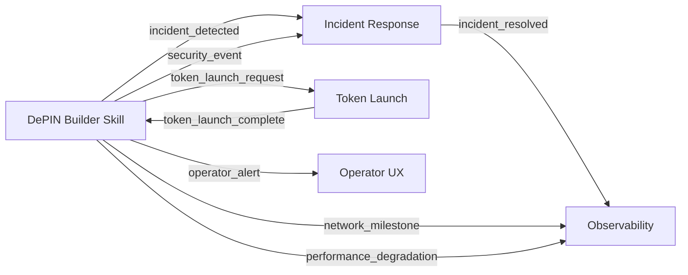

# Ecosystem Signals — Cross-Skill Integration

Define event schemas and protocols for communication between DePIN Builder Skill and other Solana AI Kit skills (Observability, Incident Response, Token Launch).

## Signal Protocol

### Signal Schema

```typescript
interface EcosystemSignal {
  signal_id: string;
  source_skill: string;
  target_skill: string;
  signal_type: SignalType;
  timestamp: number;
  payload: SignalPayload;
  priority: "low" | "medium" | "high" | "critical";
}

type SignalType =
  | "incident_detected"
  | "incident_resolved"
  | "token_launch_request"
  | "token_launch_complete"
  | "network_milestone"
  | "operator_alert"
  | "security_event"
  | "performance_degradation";

interface SignalPayload {
  [key: string]: any;
}
```

## Signal Types

### 1. Incident Detection → Incident Response Skill

**Triggered when:** Critical incident detected in DePIN network

**Source:** `skill/incident-response-integration.md`
**Target:** Incident Response Skill

```typescript
interface IncidentDetectedPayload {
  incident_id: string;
  incident_type: "oracle_down" | "network_congestion" | "smart_contract_bug" | "data_breach";
  severity: "critical" | "high" | "medium" | "low";
  description: string;
  affected_components: string[];
  first_detected: number;
  metrics: {
    error_rate?: number;
    latency_ms?: number;
    failed_transactions?: number;
  };
  suggested_actions: string[];
}

// Example signal
{
  signal_id: "inc-2024-06-29-001",
  source_skill: "depin-builder",
  target_skill: "incident-response",
  signal_type: "incident_detected",
  timestamp: 1719657600000,
  priority: "critical",
  payload: {
    incident_id: "ORACLE-001",
    incident_type: "oracle_down",
    severity: "critical",
    description: "Switchboard oracle service unresponsive for 15 minutes",
    affected_components: ["oracle-integration", "proof-submission"],
    first_detected: 1719656750000,
    metrics: {
      error_rate: 0.95,
      failed_transactions: 1247,
    },
    suggested_actions: [
      "Check oracle service status",
      "Verify oracle API keys",
      "Switch to backup oracle if available",
      "Pause network if oracle remains down >30 min",
    ],
  },
}
```

### 2. Incident Resolved → Observability Skill

**Triggered when:** Incident is resolved and normal operations resume

**Source:** `skill/incident-response-integration.md`
**Target:** Observability Skill

```typescript
interface IncidentResolvedPayload {
  incident_id: string;
  resolution_time: number;
  duration_minutes: number;
  root_cause: string;
  resolution_steps: string[];
  postmortem_required: boolean;
  affected_users: number;
  financial_impact_usd?: number;
}

// Example signal
{
  signal_id: "inc-res-2024-06-29-001",
  source_skill: "depin-builder",
  target_skill: "observability",
  signal_type: "incident_resolved",
  timestamp: 1719661200000,
  priority: "medium",
  payload: {
    incident_id: "ORACLE-001",
    resolution_time: 1719661200000,
    duration_minutes: 75,
    root_cause: "Switchboard API rate limit exceeded",
    resolution_steps: [
      "Increased rate limit quota",
      "Implemented exponential backoff",
      "Added monitoring for rate limit usage",
    ],
    postmortem_required: true,
    affected_users: 1247,
    financial_impact_usd: 2450,
  },
}
```

### 3. Token Launch Request → Token Launch Skill

**Triggered when:** DePIN network is ready for token launch

**Source:** `skill/depin-token-launch.md`
**Target:** Token Launch Skill

```typescript
interface TokenLaunchRequestPayload {
  protocol_id: string;
  protocol_name: string;
  token_symbol: string;
  total_supply: number;
  token_distribution: {
    node_rewards: number;
    treasury: number;
    team: number;
    investors: number;
    community: number;
  };
  launch_target_date: string;
  launch_exchanges: string[];
  regulatory_jurisdiction: string;
  compliance_documents: string[];
  network_metrics: {
    active_nodes: number;
    total_staked: number;
    epoch_count: number;
    average_uptime: number;
  };
}

// Example signal
{
  signal_id: "tla-2024-06-29-001",
  source_skill: "depin-builder",
  target_skill: "token-launch",
  signal_type: "token_launch_request",
  timestamp: 1719657600000,
  priority: "high",
  payload: {
    protocol_id: "depin-connectivity-001",
    protocol_name: "DePIN Connectivity",
    token_symbol: "DPC",
    total_supply: 10000000000,
    token_distribution: {
      node_rewards: 4000000000,
      treasury: 2500000000,
      team: 1500000000,
      investors: 1000000000,
      community: 1000000000,
    },
    launch_target_date: "2024-09-01",
    launch_exchanges: ["Binance", "Coinbase", "Kraken"],
    regulatory_jurisdiction: "Cayman Islands",
    compliance_documents: [
      "legal-opinion.pdf",
      "tokenomics-paper.pdf",
      "smart-contract-audit.pdf",
    ],
    network_metrics: {
      active_nodes: 5000,
      total_staked: 500000,
      epoch_count: 120,
      average_uptime: 0.96,
    },
  },
}
```

### 4. Token Launch Complete → Network Growth Skill

**Triggered when:** Token is successfully launched and trading

**Source:** Token Launch Skill
**Target:** `skill/network-growth.md`

```typescript
interface TokenLaunchCompletePayload {
  protocol_id: string;
  token_symbol: string;
  launch_date: string;
  launch_price_usd: number;
  current_price_usd: number;
  market_cap_usd: number;
  trading_volume_24h_usd: number;
  listed_exchanges: string[];
  liquidity_pools: {
    dex: string;
    pair: string;
    liquidity_usd: number;
  }[];
}

// Example signal
{
  signal_id: "tlc-2024-09-01-001",
  source_skill: "token-launch",
  target_skill: "depin-builder",
  signal_type: "token_launch_complete",
  timestamp: 1725196800000,
  priority: "high",
  payload: {
    protocol_id: "depin-connectivity-001",
    token_symbol: "DPC",
    launch_date: "2024-09-01",
    launch_price_usd: 0.05,
    current_price_usd: 0.06,
    market_cap_usd: 600000000,
    trading_volume_24h_usd: 15000000,
    listed_exchanges: ["Binance", "Coinbase", "Kraken"],
    liquidity_pools: [
      {
        dex: "Raydium",
        pair: "DPC/SOL",
        liquidity_usd: 5000000,
      },
      {
        dex: "Orca",
        pair: "DPC/USDC",
        liquidity_usd: 3000000,
      },
    ],
  },
}
```

### 5. Network Milestone → Observability Skill

**Triggered when:** Network reaches significant milestone

**Source:** `skill/network-growth.md`
**Target:** Observability Skill

```typescript
interface NetworkMilestonePayload {
  milestone_type: "nodes" | "stake" | "epochs" | "coverage" | "revenue";
  milestone_value: number;
  previous_milestone: number;
  achievement_date: string;
  context: {
    description: string;
    significance: string;
    next_target: number;
  };
}

// Example signal
{
  signal_id: "mile-2024-06-29-001",
  source_skill: "depin-builder",
  target_skill: "observability",
  signal_type: "network_milestone",
  timestamp: 1719657600000,
  priority: "medium",
  payload: {
    milestone_type: "nodes",
    milestone_value: 10000,
    previous_milestone: 5000,
    achievement_date: "2024-06-29",
    context: {
      description: "Network reached 10,000 active nodes",
      significance: "2x node growth in 3 months",
      next_target: 25000,
    },
  },
}
```

### 6. Operator Alert → Operator UX Skill

**Triggered when:** Operator needs attention (earnings drop, node offline)

**Source:** `agents/operator-ux-engineer.md`
**Target:** Operator UX System

```typescript
interface OperatorAlertPayload {
  operator_id: string;
  node_ids: string[];
  alert_type: "earnings_drop" | "node_offline" | "stake_risk" | "firmware_update";
  severity: "critical" | "warning" | "info";
  message: string;
  affected_metrics: {
    earnings_usd?: number;
    uptime_pct?: number;
    stake_sol?: number;
  };
  suggested_action: string;
  action_deadline?: string;
}

// Example signal
{
  signal_id: "alert-2024-06-29-001",
  source_skill: "depin-builder",
  target_skill: "operator-ux",
  signal_type: "operator_alert",
  timestamp: 1719657600000,
  priority: "high",
  payload: {
    operator_id: "op-8472",
    node_ids: ["node-8472-1", "node-8472-2"],
    alert_type: "earnings_drop",
    severity: "warning",
    message: "Daily earnings dropped 40% due to node offline",
    affected_metrics: {
      earnings_usd: 0.38,
      uptime_pct: 0.72,
    },
    suggested_action: "Check node status and restore connectivity",
    action_deadline: "2024-06-30T00:00:00Z",
  },
}
```

### 7. Security Event → Incident Response Skill

**Triggered when:** Security vulnerability or attack detected

**Source:** `rules/depin-safety.md`
**Target:** Incident Response Skill

```typescript
interface SecurityEventPayload {
  event_type: "vulnerability" | "attack" | "unauthorized_access" | "key_compromise";
  severity: "critical" | "high" | "medium" | "low";
  description: string;
  affected_component: string;
  detected_at: number;
  indicators: {
    ip_addresses?: string[];
    wallet_addresses?: string[];
    transaction_signatures?: string[];
    vulnerability_id?: string;
  };
  containment_status: "contained" | "in_progress" | "not_contained";
  mitigation_steps: string[];
}

// Example signal
{
  signal_id: "sec-2024-06-29-001",
  source_skill: "depin-builder",
  target_skill: "incident-response",
  signal_type: "security_event",
  timestamp: 1719657600000,
  priority: "critical",
  payload: {
    event_type: "attack",
    severity: "critical",
    description: "Sybil attack detected - 50 nodes from same IP range",
    affected_component: "node-registry",
    detected_at: 1719657000000,
    indicators: {
      ip_addresses: ["192.168.1.100-192.168.1.150"],
      wallet_addresses: ["7xKs...xY9z", "8f2a...3b9c"],
    },
    containment_status: "in_progress",
    mitigation_steps: [
      "Jail affected nodes",
      "Slash stake",
      "Block IP range",
      "Review registration process",
    ],
  },
}
```

### 8. Performance Degradation → Observability Skill

**Triggered when:** Network performance drops below threshold

**Source:** `skill/network-architecture.md`
**Target:** Observability Skill

```typescript
interface PerformanceDegradationPayload {
  metric_type: "latency" | "throughput" | "error_rate" | "gas_cost";
  current_value: number;
  threshold_value: number;
  degradation_pct: number;
  affected_service: string;
  started_at: number;
  duration_minutes: number;
  potential_causes: string[];
}

// Example signal
{
  signal_id: "perf-2024-06-29-001",
  source_skill: "depin-builder",
  target_skill: "observability",
  signal_type: "performance_degradation",
  timestamp: 1719657600000,
  priority: "medium",
  payload: {
    metric_type: "latency",
    current_value: 5000,
    threshold_value: 1000,
    degradation_pct: 400,
    affected_service: "proof-submission",
    started_at: 1719654000000,
    duration_minutes: 60,
    potential_causes: [
      "Network congestion",
      "Oracle service slowdown",
      "Smart contract inefficiency",
    ],
  },
}
```

## Signal Emission

### Emitting a Signal

```typescript
// Signal emitter utility

class SignalEmitter {
  private signalQueue: EcosystemSignal[] = [];

  async emit(signal: EcosystemSignal): Promise<void> {
    // Validate signal
    this.validateSignal(signal);

    // Add to queue
    this.signalQueue.push(signal);

    // Emit to target skill
    await this.deliverSignal(signal);

    // Log for observability
    await this.logSignal(signal);
  }

  private validateSignal(signal: EcosystemSignal): void {
    if (!signal.signal_id) throw new Error("Signal ID required");
    if (!signal.source_skill) throw new Error("Source skill required");
    if (!signal.target_skill) throw new Error("Target skill required");
    if (!signal.signal_type) throw new Error("Signal type required");
    if (!signal.timestamp) throw new Error("Timestamp required");
  }

  private async deliverSignal(signal: EcosystemSignal): Promise<void> {
    // Deliver via webhook, message queue, or direct API call
    const endpoint = this.getSignalEndpoint(signal.target_skill);
    
    await fetch(endpoint, {
      method: "POST",
      headers: { "Content-Type": "application/json" },
      body: JSON.stringify(signal),
    });
  }

  private async logSignal(signal: EcosystemSignal): Promise<void> {
    // Log to observability system
    console.log(`[SIGNAL] ${signal.signal_type} from ${signal.source_skill} to ${signal.target_skill}`);
  }
}

// Usage
const emitter = new SignalEmitter();

await emitter.emit({
  signal_id: "inc-2024-06-29-001",
  source_skill: "depin-builder",
  target_skill: "incident-response",
  signal_type: "incident_detected",
  timestamp: Date.now(),
  priority: "critical",
  payload: {
    incident_id: "ORACLE-001",
    incident_type: "oracle_down",
    severity: "critical",
    description: "Switchboard oracle service unresponsive",
    affected_components: ["oracle-integration"],
    first_detected: Date.now() - 900000,
    metrics: { error_rate: 0.95 },
    suggested_actions: ["Check oracle service status"],
  },
});
```

## Signal Reception

### Receiving a Signal

```typescript
// Signal receiver utility

class SignalReceiver {
  private handlers: Map<SignalType, SignalHandler> = new Map();

  registerHandler(signalType: SignalType, handler: SignalHandler): void {
    this.handlers.set(signalType, handler);
  }

  async receive(signal: EcosystemSignal): Promise<void> {
    const handler = this.handlers.get(signal.signal_type);
    
    if (!handler) {
      console.warn(`No handler registered for signal type: ${signal.signal_type}`);
      return;
    }

    await handler.handle(signal);
  }
}

interface SignalHandler {
  handle(signal: EcosystemSignal): Promise<void>;
}

// Example handler for incident_detected
class IncidentDetectedHandler implements SignalHandler {
  async handle(signal: EcosystemSignal): Promise<void> {
    const payload = signal.payload as IncidentDetectedPayload;
    
    console.log(`Incident detected: ${payload.incident_id}`);
    console.log(`Severity: ${payload.severity}`);
    console.log(`Description: ${payload.description}`);
    
    // Trigger incident response workflow
    await this.triggerIncidentResponse(payload);
  }

  private async triggerIncidentResponse(payload: IncidentDetectedPayload): Promise<void> {
    // Create incident ticket
    // Notify on-call engineer
    // Start mitigation procedures
  }
}

// Usage
const receiver = new SignalReceiver();

receiver.registerHandler("incident_detected", new IncidentDetectedHandler());

// Receive signal (typically called by webhook endpoint)
await receiver.receive({
  signal_id: "inc-2024-06-29-001",
  source_skill: "depin-builder",
  target_skill: "incident-response",
  signal_type: "incident_detected",
  timestamp: Date.now(),
  priority: "critical",
  payload: {
    incident_id: "ORACLE-001",
    incident_type: "oracle_down",
    severity: "critical",
    description: "Switchboard oracle service unresponsive",
    affected_components: ["oracle-integration"],
    first_detected: Date.now() - 900000,
    metrics: { error_rate: 0.95 },
    suggested_actions: ["Check oracle service status"],
  },
});
```

## Signal Flow Diagram



## Signal Storage

### Signal Log

```typescript
// Store signals for audit and replay

interface SignalLog {
  signal: EcosystemSignal;
  delivery_status: "delivered" | "failed" | "pending";
  delivery_attempts: number;
  last_attempt: number;
  error_message?: string;
}

class SignalStore {
  private signals: SignalLog[] = [];

  async log(signal: EcosystemSignal, status: "delivered" | "failed" | "pending"): Promise<void> {
    this.signals.push({
      signal,
      delivery_status: status,
      delivery_attempts: 1,
      last_attempt: Date.now(),
    });
  }

  async getSignalHistory(skill: string, limit: number = 100): Promise<SignalLog[]> {
    return this.signals
      .filter(s => s.signal.source_skill === skill || s.signal.target_skill === skill)
      .slice(-limit);
  }

  async replaySignal(signalId: string): Promise<void> {
    const signalLog = this.signals.find(s => s.signal.signal_id === signalId);
    
    if (!signalLog) {
      throw new Error(`Signal not found: ${signalId}`);
    }

    await this.deliverSignal(signalLog.signal);
  }
}
```

## Integration Checklist

Before implementing ecosystem signals:
- [ ] Signal schema defined for all signal types
- [ ] Signal emitter implemented
- [ ] Signal receiver implemented
- [ ] Signal handlers registered for each signal type
- [ ] Signal logging and storage operational
- [ ] Signal replay mechanism implemented
- [ ] Error handling for failed signal delivery
- [ ] Rate limiting for signal emission
- [ ] Authentication for signal endpoints
- [ ] Monitoring for signal flow health
